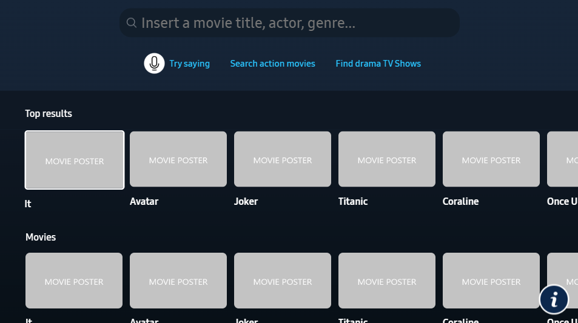
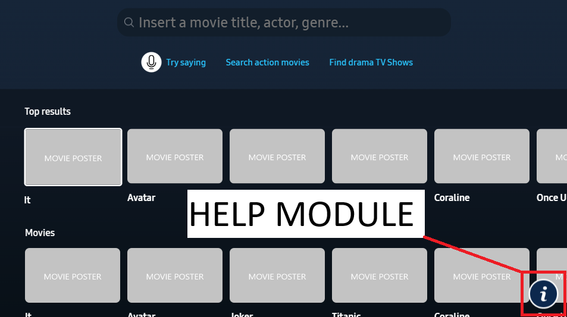

# Sample Application for the Voice Interaction Web API

> [!TIP]
> Supports remote control functions and voice commands

## How to use

For a quick explanation on how to navigate, how to use the search features, media controls, etc. You can go to:

[Go to How to use docs](docs/howToUse/howToUse.md)

## Implementation

In order to create a custom implementation you can follow the next documentation:

[Go to implementation docs](docs/implementation/0_readThisFirst.md)

## Getting Help

This is a public app developed by the Bixby Samsung Research Tijuana team, in order to request support you can:

* Use the [Github issue tracker](https://github.com/SamsungDForum/SampleWebApps-VIF/issues) to see if someone else has a similar issue, or to file a new one
* Contact Roberto Yllescas (`roberto.y@samsung.com`) to request specific support outside the implementation scope detailed in this repository
* Read the integrated help module. This module includes three different sections to help you out: the user manual, a remote control functionality section, and a FAQ section. If you have a question while using the app we recommend to check it out. To do so, please click the "info" button on the bottom right corner of the screen.

